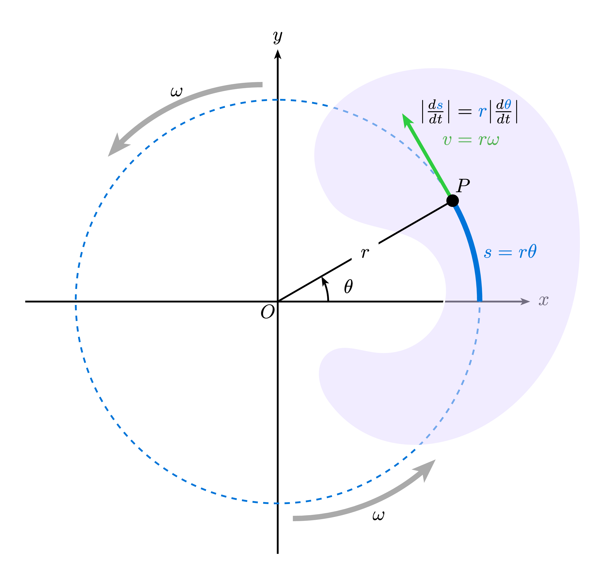
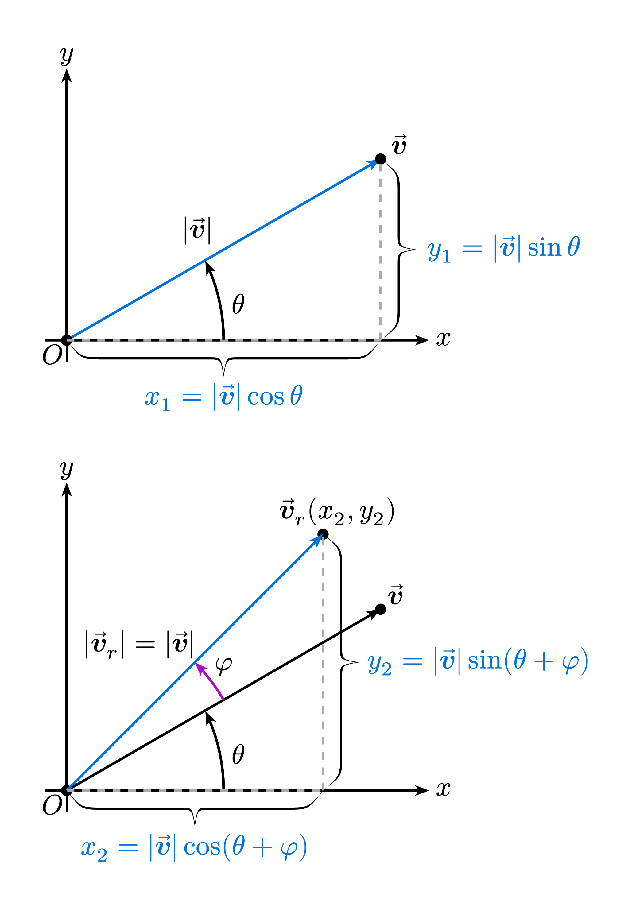
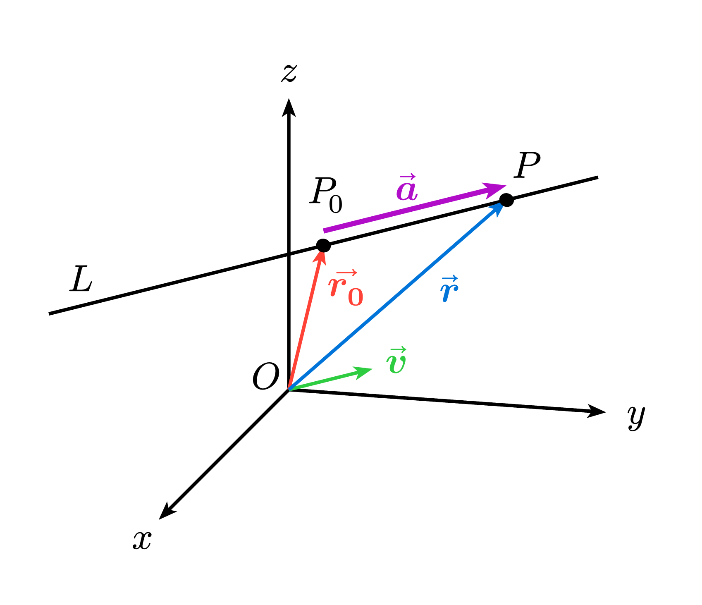

# Typst-Notes

A modular, multi-file Typst project for physics and mathematics notes, featuring custom illustrations, GRE practice questions, and APA-cited references. This repository serves as a personal notebook, a demonstration of Typst capabilities, and a reusable template for STEM students and Typst enthusiasts.

- **Typst Version:** `0.14.2`

## Table of Contents

- [Overview](#overview)
- [Motivation](#motivation)
- [Features](#features)
- [Installation](#installation)
- [Repository Layout](#repository-layout)
- [Example Output](#example-output)
- [Project Template (Mini Example)](#project-template)

---

## Overview

`Typst-Notes` is a book-like, multi-file Typst project where:

- **Modules** provide reusable helper functions (e.g., axes, blocks, math macros).
- **Illustrations** are generated programmatically using Typst and CETZ.
- **Content pages** contain physics/math notes, GRE practice questions, and Desmos graphing demos.
- All components are combined into a single document via `main.typ`.

Each page, illustration, or problem is allocated to its own `.typ` file for modularity and easier navigation.

---

## Motivation

This project was created to:

* Learn Typst for scientific document preparation.

* Practice physics and mathematics by recreating illustrations using pure math and generating Desmos graphing demos.

* Replace physical notes with a digital, searchable, and well-organized system.


All problems and equations include APA citations to source material, allowing readers to verify the reasoning rather than accept assertions uncritically.

---

## Features

- **APA Citation Support**
  Uses a `.bib` file (`refLiterature.bib`) with APA citation style.

- **Custom Block Templates**
  - Styled block templates for various content types.
  - `solution-block`: includes the QED symbol by default.

- **Advanced Figure Support**
  - `sub-figures`: helper for subfigures with captions.
  - `flex-caption`: supports both long and short captions.
    - Short caption appears in the outline.
    - Long caption appears in the main figure.


- **Multi-File Project Support**
  - Configuration and modules are designed to work with multi-file projects, not just single-file documents.


---

## Installation

### Requirements

- **Typst** version `0.14.2` (or compatible).


### Installation on WSL (Ubuntu)

If you are using WSL with Ubuntu:

1. Install Typst via the official instructions or your preferred method.
2. Ensure `typst` is available in your shell:
   ```bash
   typst --version
   ```
3. Clone this repository:
   ```bash
   git clone <repository-url>
   cd Typst-Notes
   ```

If you use the Typst online editor, you can copy the relevant `.typ` files into the editor and compile `main.typ` there.


---
## Repository Layout

```text
Typst-Notes/
  content/              # Contains the content pages
    math.typ            # Math notes
    physics.typ         # Physics notes
    questions.typ       # Practice questions
  docs/                 # Demo PDFs and images
    image_examples/     # PNG images of illustrations
  illustrations/        # Drawings using CETZ
    circuits/           # Circuit drawings
    math/               # Math drawings
    physics/            # Physics drawings
    questions/          # Drawings for practice questions
  modules/              # Helper functions used across the project
  config.typ            # Page configuration (margins, fonts, styles)
  main.typ              # Main entry file combining all content
  refLiterature.bib     # Bibliography file (APA style)
```

Each directory is modular: you can import only the parts you need into your own projects.

---


## Example Output


> Example:
> - [Download example PDF](docs/notesDemo.pdf)
> - Or view screenshots in `docs/` or `image_examples/`.

[Desmos Example: Tangent line to a circle](https://www.desmos.com/calculator/9cyvuqjkpc)
- [Typst drawing code](illustrations/physics/linearSpeedRotation.typ)



[Desmos Example: Line Segment Rotation](https://www.desmos.com/calculator/tbr6wdhvre)
- [Typst drawing code](illustrations/math/vectorRotationIMG.typ)



[Typst drawing code: Parametic Line](illustrations/math/parametricLine.typ)

---

## Project Template
A minimal, standalone Typst template is provided for users who want a clean starting point based on this project’s configuration and modules.

* Location: `docs/project_template/`
* Contents:

  * `main.typ` — Example entry file with:

    * Numbering examples

    * Custom blocks (including `solution-block` with QED)

    * APA-style citations

    * Subfigures with `flex-caption`

  * `config.typ` — Page configuration (margins, fonts, styles)

  * `blocks.typ` — Block templates

  * `subfigures.typ` — Subfigure and caption helpers

  * `<your-project>.bib` — Bibliography file (APA style)

The template:

* Does not include content pages, practice questions, or large illustrations.

* Does not include complex CETZ drawings or demo graphs.

* Provides examples of:

  * Section and problem numbering

  * Styled blocks

  * Citations

  * Subfigures with long/short captions

You can:

* Use this as a minimal starting point for your own notes.

* Copy specific modules (e.g., blocks.typ, subfigures.typ) into your own project.

* Add your own content in content/, math/, physics/, etc., following the style from this template.